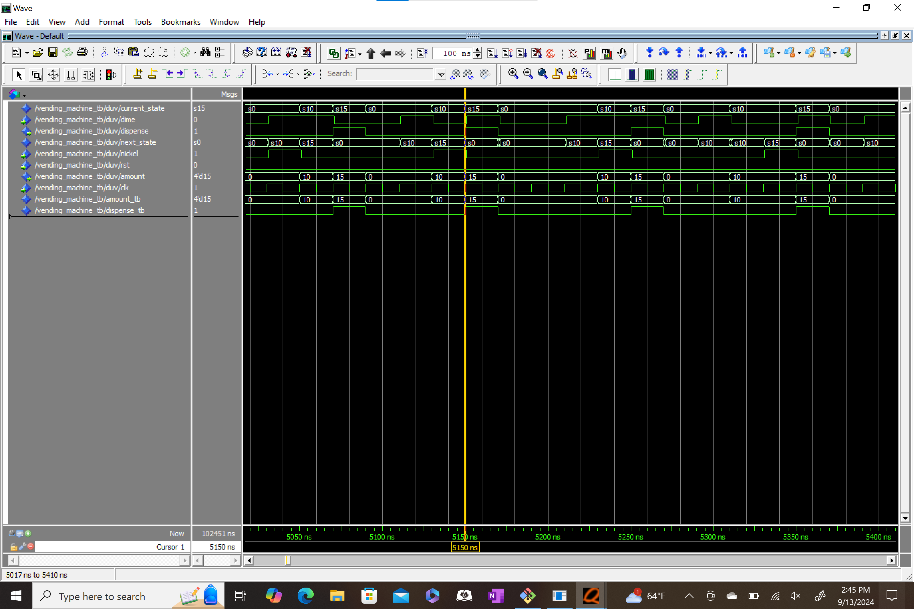
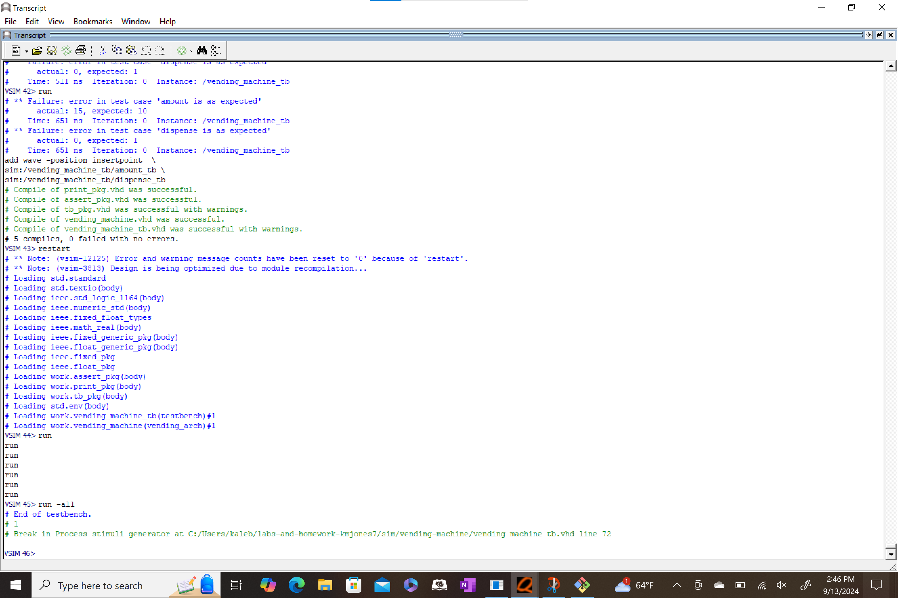

# Homework 5: Vending Machine VHDL
## Overview

A vending machine was modeled in VHDL using a finite state machine. Two processes were created: one process handled the state memory, while the other process handled the next state logic and output. 

When a user spends 15 cents, the vending machine will dispense an item. The vending machine will display the amount of money that the user has put in (up to 15 cents). The vending machine will take two inputs from user: a nickel, and a dime. If a nickel and dime are put into the vending machine at the same time, the vending machine will only register the dime. 

## Deliverables

**Waveform for HW 5**

**Transcript for HW 5**

