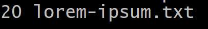

# HW 7
## Overview
In this homework assignment, linux commands were used to sort, cut, and find various elements in files. 
## Deliverables

### Problem 1
command: ` wc -w lorem-ipsum.txt`  
output:  

### Problem 2
command: `wc -m lorem-ipsum.txt`  
output:   

### Problem 3
command: `wc -l lorem-ipsum.txt`  
output:  

### Problem 4
command: `sort -h file-sizes.txt`  
output:    

### Problem 5
command:  `sort -h -r file-sizes.txt`  
output:  

### Problem 6
command: `cut -d ',' -f 3 log.csv`    
output:  

### Problem 7
command: `cut -d ',' -f 2,3 log.csv`  
output:  

### Problem 8
command: `cut -d ',' -f 1,4 log.csv`  
output:  

### Problem 9
command: `head -n 3 gibberish.txt`  
output:  

### Problem 10
command: `tail -n 2 gibberish.txt`  
output:  

### Problem 11
command: `tail -n +2 log.csv`  
output:  

### Problem 12
command: `grep and gibberish.txt`  
output:  

### Problem 13
command: `grep we -n -w gibberish.txt`  
output:  

### Problem 14
command: `grep -i -o -P 'to\s+\w+' gibberish.txt`  
output:  

### Problem 15
command: `grep FPGAs -w -c fpgas.txt`  
output:  

### Problem 16
command: `grep -e 'ot' -e 'ower' -e 'ile' fpgas.txt`  
output:  

### Problem 17
command: `grep -r '^-' -c LED_Patterns/*.vhd`  
output:  

### Problem 18
command: `ls > p18.txt`  
output:  

### Problem 20
command: `find hdl -iname '*.vhd' | wc -l`  
output:  

### Problem 21
command: `grep -roi '^--' hdl | wc -l`  
output:  

### Problem 22
command: `grep FPGAs -n fpgas.txt | cut -d ':' -f 1`  
output:  

### Problem 23
command: `du -h * | sort -h | tail -n 3`  
output:  

