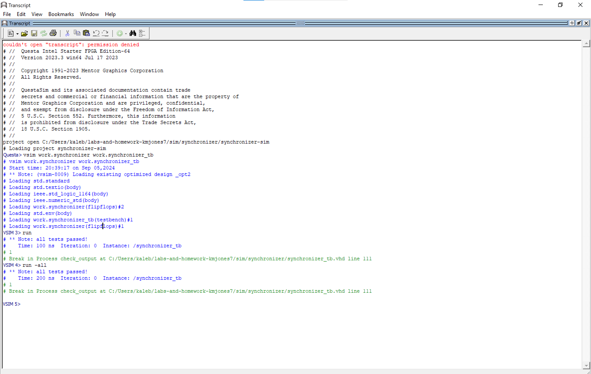

**HW 3 - Synchronizer**

**Overview**\
In this lab, a synchronizer was modeled with two D-flip-flops in VHDL.

**Deliverables**\
Here is a screenshot from the terminal window:

Here is a screenshot of the waveform: 

All Tests Passed!