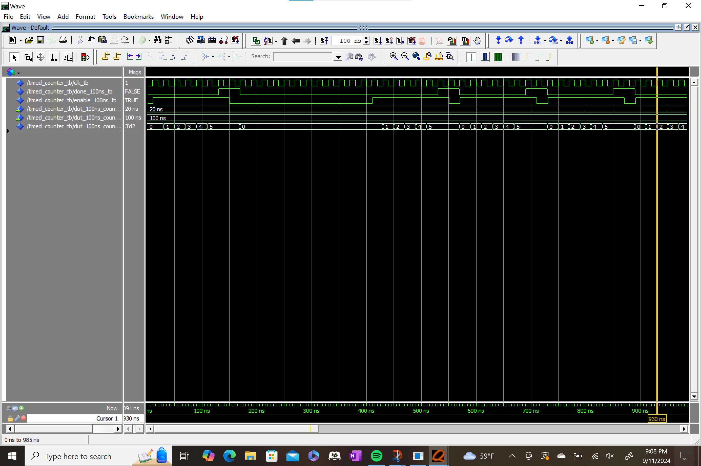
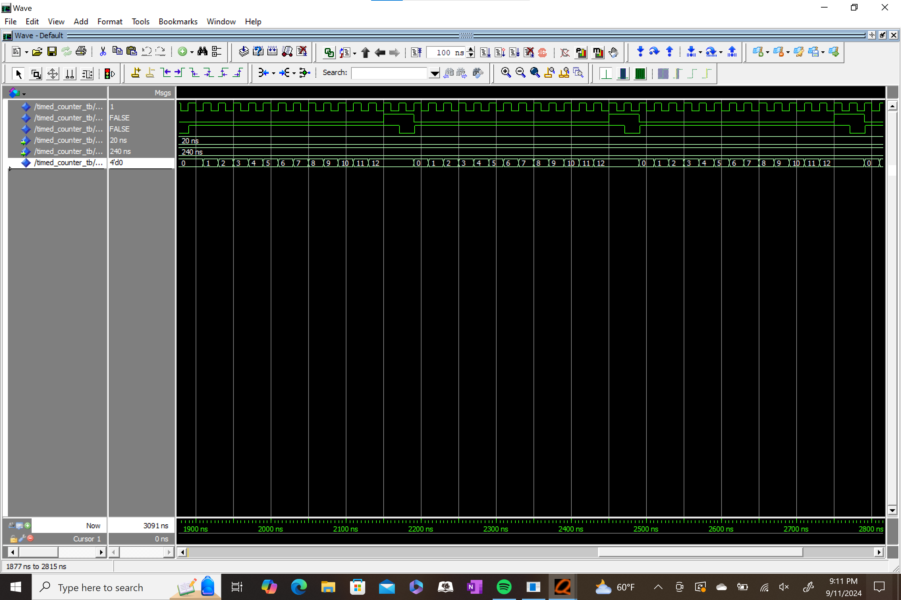

# Lab 4: Timed Counter VHDL

## Overview
In this homework assignment, a timed counter was created in VHDL. The counter was supposed to count for a specified time, signal that it is done counting, and then stop counting. A provided testbench file was modified to test this counter under three success cases for two various count-times:

1. test that the counter signals 'done' at the right time when the counter is enabled
2. test that the counter doesn't signal that it's done counting when it's been disabled
3. test that the counter can count, stop counting, reset, and provide appropriate signals when it's been enabled for multiple periods

## Deliverables

Transcript window for tests 1 through 5

Transcript window for test 6

Waveform for tests 1 through 3

Waveform for tests 4 through 5

Waveform for test 6
