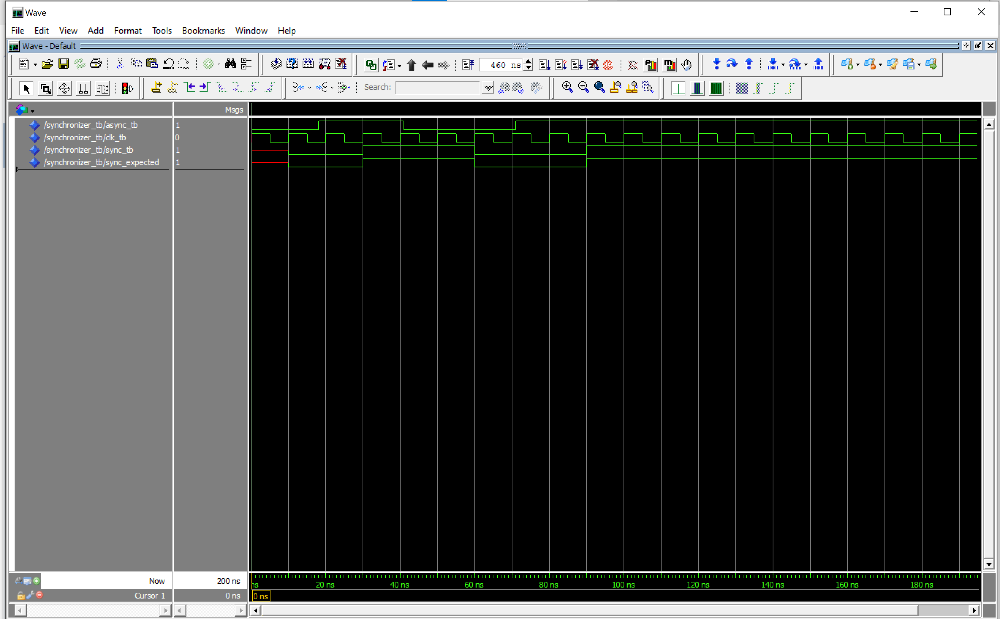
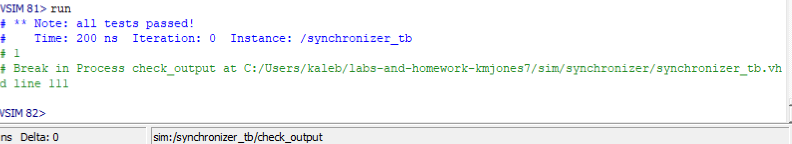
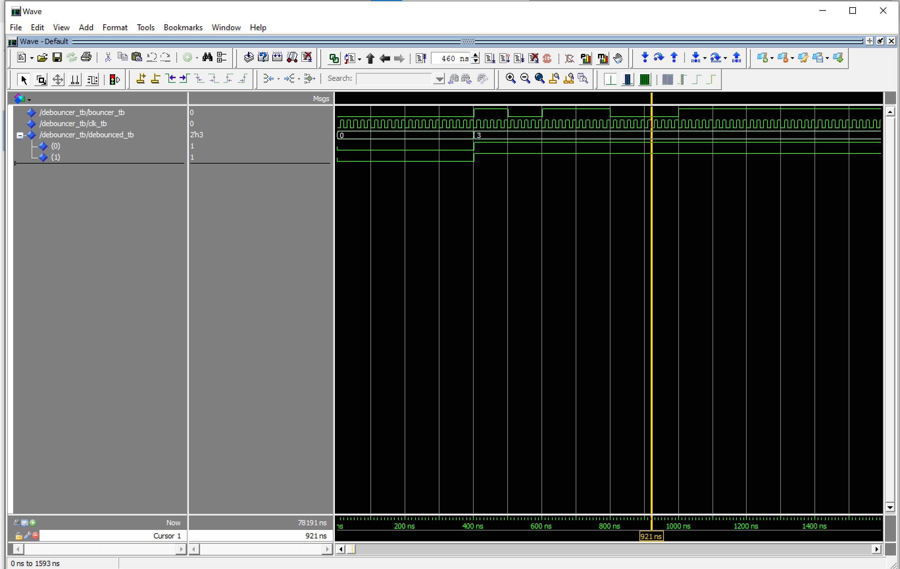
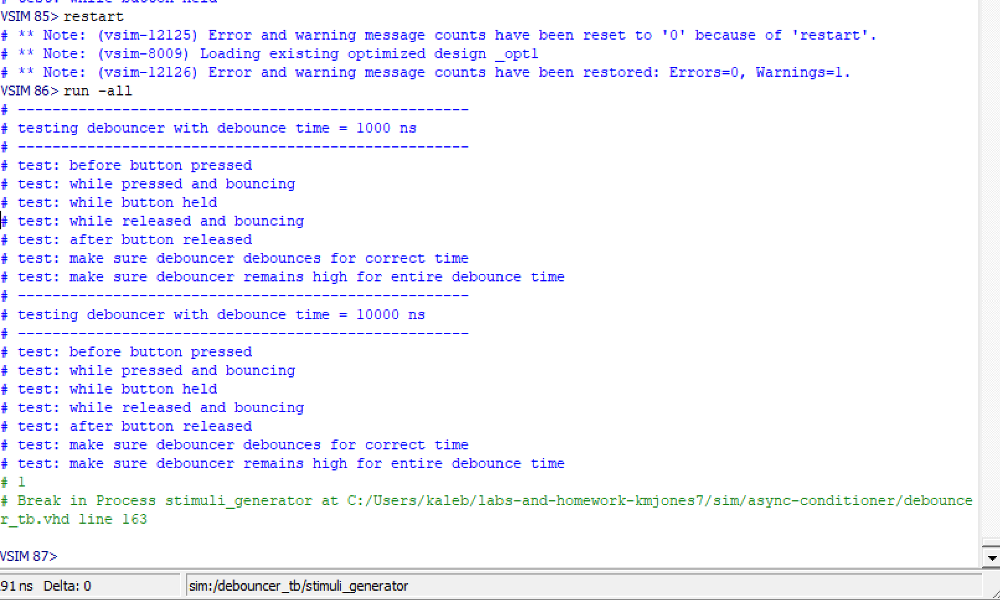
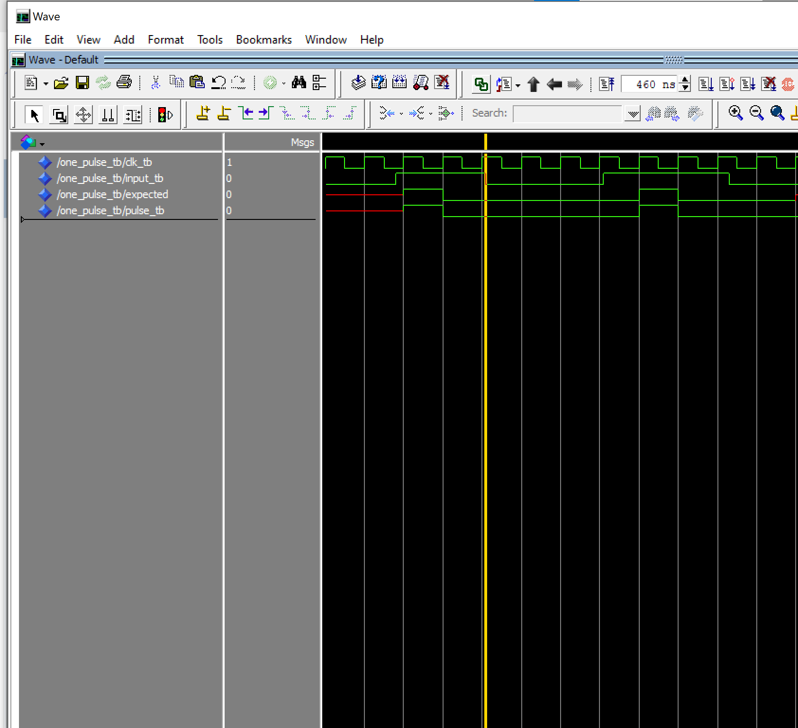
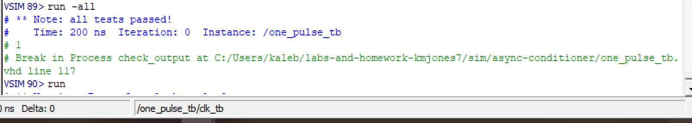
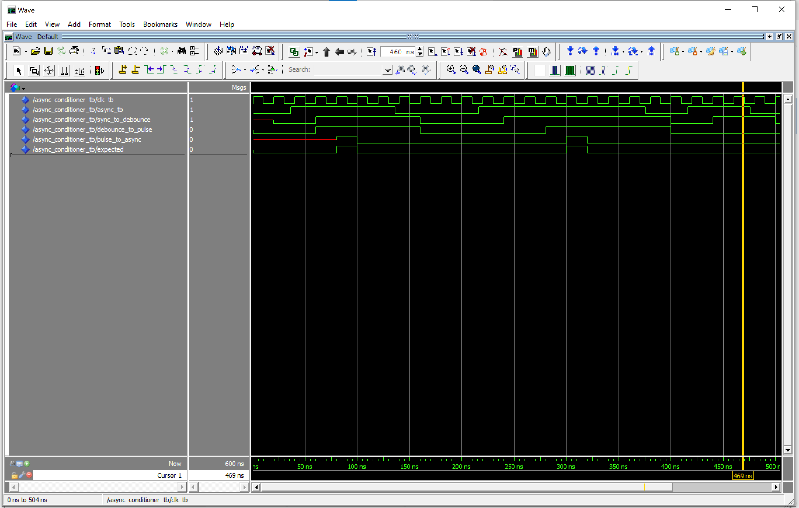

# HW6 : Asynchronous Conditioner

## Overview
In this assignment, a system was designed to take in an asynchronous signal and produce a single pulse output. Three components were created to implement this design: synchronizer, debouncer, and one pulse. The synchronizer synchronized the input to the system's clock. The debouncer prevented the system from reading any input immediately following the initial input for a certain period of time. This avoids reading any switch bouncing. The one pulse component outputted a single pulse with a period of 1 clock cycle when the input goes high. An asynchronous conditioner file was created to connect all of these components together. A testbench was created for each component.

## Deliverables

Synchronizer Waveform

Synchronizer Transcript

Debouncer Waveform

Debouncer Transcript

One Pulse Waveform

One Pulse Transcript

Async Conditioner Waveform
