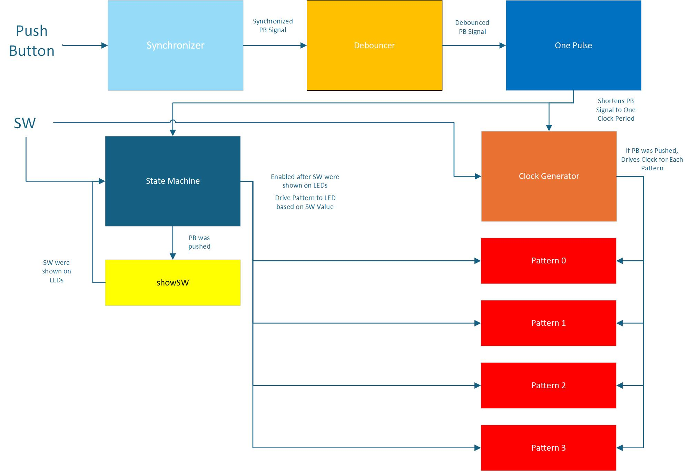
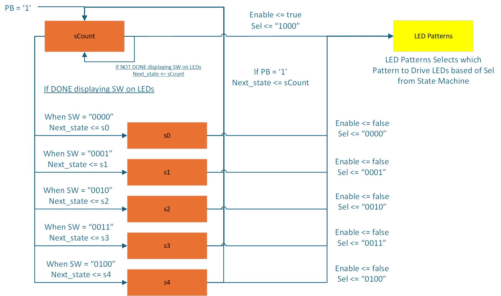

# **Lab 4**
## Project Overview

In this lab, VHDL code was written to take in 2 inputs from the user and output an LED Pattern based on the switch input. 5 Patterns were created for switch patterns "0000" through "0100". Each pattern toggled LEDs differently and at different rates. For a switch sequence's LED pattern to be displayed on the LEDs, the push button must first be pushed. Once the push button was pushed, the binary value of the switches was displayed on the LEDs for one second before the LED pattern began. 

## System Architecture

The following figure shows the VHDL components that were created and how they interact with each other.

### Synchronizer
When the user pushes the push button, the Synchronizer component synchronizes the push button signal to the system clock. 

### Debouncer
The Debouncer component takes in the synchronized push-button signal from the Synchronizer component and removes any switch bouncing.

### One Pulse
The One Pulse component takes in the synchronized, debounced signal from the Debouncer component and holds the signal high for 1 clock cycle. 

### Clock Generator
The Clock Generator component takes in the push button signal from the One Pulse component. When the signal is high, the component assigns a max counter value based on the current switch value. A clock is then generated using the assigned max counter value.

### State Machine
The following image shows a block diagram of the State Machine component. This component handles enabling the ShowSw Component and the Pattern Components. 

### Pattern1 - Pattern3 Generators
Each Pattern component generates a different LED pattern with a clock from the clock generator. 

### ShowSW
The ShowSW component takes in the signal from the One Pulse component. If the signal from the One Pulse component is high, this component uses the system clock to drive a counter. This counter is used to display the current switch value to the LEDs for 1 second.

## Implementation Details

### Pattern4 Generator

This Pattern had it's own State Machine. The LED Pattern was driven by a clock that was 1/16 the period of the system clock. This State Machine contained 4 Processes: State Memory, Counter, Next State Logic, and Output Logic.

**State Memory**: On the rising edge of the clock, the current state was assigned to next state. 

**Counter**: On the rising edge of the clock, a counter was incremented. Once the counter = 4, it toggled the startOver boolean signal. 

**Next State Logic**: If the startOver signal was false, the next_state was assigned to the next higher state. For instance, if current state = s0, next state = s1. If the startOver signal was true, the next_state was assigned to the next lower state. For instance, if current state = s2, next state = s1. This processes created the following pattern on the LEDs.

    0000000
    1000001
    0100010
    0010100
    0001000
    0010100
    0100010
    1000001
    0000000

This pattern would repeat

**Output Logic**: The following case statement shows what was driven to the LEDs based on the current state.

    when s0 => internLEDS <= "0000000"
    when s1 => internLEDs <= "1000001"
    when s2 => internLEDs <= "0100010"
    when s3 => internLEDs <= "0010100"
    when s4 => internLEDs <= "0001000"
